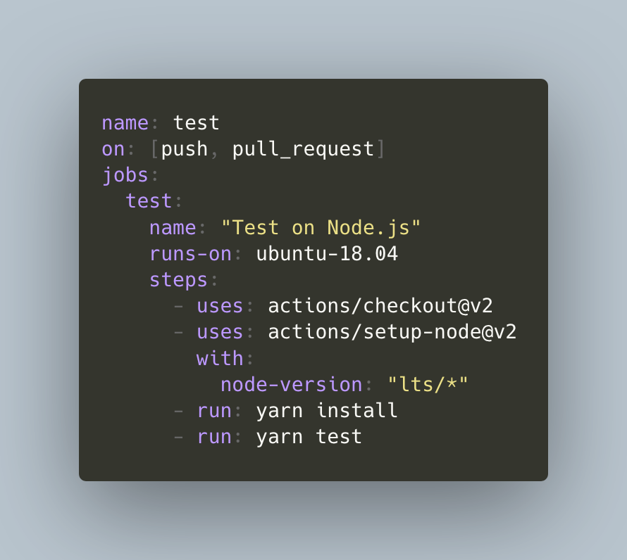
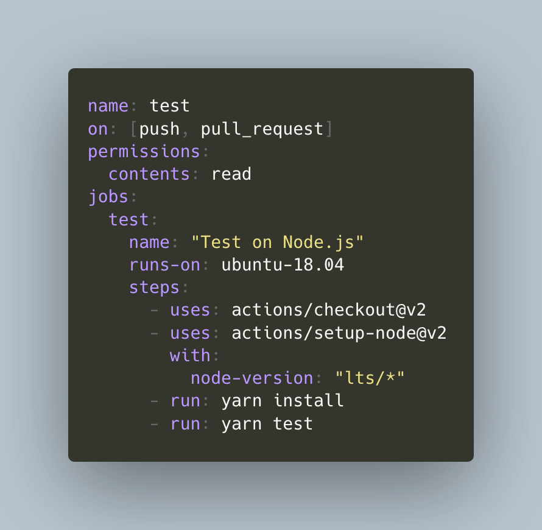

# @pkgdeps/update-github-actions-permissions 

Update GitHub Actions&#39;s `permissions` automatically.

|                    Before                    |                   After                    |
|:--------------------------------------------:|:------------------------------------------:|
|  |  |

## Features

- Detect using Actions and add `permissions` field to your action yaml file
- Support [40+ GitHub Actions](./actions.yml)

## Install

Install with [npm](https://www.npmjs.com/):

    npm install @pkgdeps/update-github-actions-permissions --global

or Install and Run via `npx` command:

    npx @pkgdeps/update-github-actions-permissions ".github/workflows/*.{yaml,yml}"

## Usage

    Usage
      $ update-github-actions-permissions "[file|glob]"
 
    Options
      --defaultPermissions                [String] "write-all" or "read-all". Default: "write-all"
      --verbose                           [Boolean] If enable verbose, output debug info.
 
    Examples
      $ update-github-actions-permissions ".github/workflows/test.yml"
      # multiple inputs
      $ update-github-actions-permissions ".github/workflows/test.yml" ".github/workflows/publish.yml" 
      $ update-github-actions-permissions ".github/workflows/*.{yml,yaml}"

## Add action's `permissions`

This tool manage `permissions` in [actions.yml](./actions.yml).

If you want to improve the `permissions` definitions, please edit [actions.yml](./actions.yml).

1. Edit [actions.yml](./actions.yml)
2. Submit a Pull Request

## Detection logics

- Read your workflow file
- Collect `uses` actions or `env` which is using `${{ secrets.GITHUB_TOKEN }}`
- Match actions with [actions.yml](./actions.yml)
- If found unknown actions, write `defaultPermissions`(`permissions: write-all`) to workflow file.
- If found `env` usage, write `defaultPermissions`(`permissions: write-all`) to workflow file.
    - :memo: `NODE_AUTH_TOKEN` is special pattern. Current treats it as `contents: read` and `packages: write`.
- Else, put `permission: <combined permissions>` to workflow file.

## Changelog

See [Releases page](https://github.com/pkgdeps/update-github-actions-permissions/releases).

## Running tests

Install devDependencies and Run `npm test`:

    npm test

## Contributing

Pull requests and stars are always welcome.

For bugs and feature
requests, [please create an issue](https://github.com/pkgdeps/update-github-actions-permissions/issues).

1. Fork it!
2. Create your feature branch: `git checkout -b my-new-feature`
3. Commit your changes: `git commit -am 'Add some feature'`
4. Push to the branch: `git push origin my-new-feature`
5. Submit a pull request :D

## Author

- azu: [GitHub](https://github.com/azu), [Twitter](https://twitter.com/azu_re)

## License

This package is licensed under the AGPL(GNU Affero General Public License) v3.0.
Because this package includes AGPL-licensed [third-party](third-party/) resources like [step-security/secure-workflows](https://github.com/step-security/secure-workflows).

- [secure-workflows.yml](third-party/secure-workflows.yml): AGPL v3.0 ©️ [step-security/secure-workflows](https://github.com/step-security/secure-workflows)

However, Next files are available under the [MIT license](./LICENSE-MIT):

- `bin/*`
- `src/*`
- `lib/*`
- `module/*`
- `test/*`
- `action.yml`

## Related

- [step-security/secure-workflows: Secure GitHub Actions CI/CD workflows via automated remediations](https://github.com/step-security/secure-workflows)
